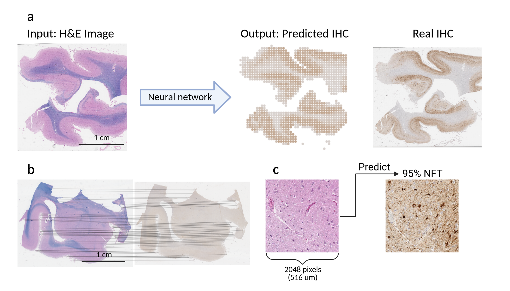

## AI-enabled In Silico Immunohistochemical Staining for Alzheimer’s Disease




### Overview

in silico-IHC is a system for predicting the results of immunohistochemical (IHC) staining from routinely collected histochemically-stained (H&E) samples.
This repository contains code to run the model, along with the steps needed to train the model, including:
  1) Registering the IHC-stained slides with the H&E stained slides
  2) Identifying IHC patches containing amyloid plaques, neurofibrillary tangles, and neuritic plaques
  3) Training the deep learning model to predict from H&E-stained slides

### Installation

First, clone this repository and enter the directory by running:
```
git clone https://github.com/bryanhe/insilico-ihc.git
cd insilico-ihc
```

We recommend using [Anaconda](https://conda.io) for managing packages.
Using Anaconda, our code can be installed by running:
```
conda install pixman=0.36.0  # Fix issue in OpenSlide (see https://github.com/openslide/openslide/issues/278)
pip install -r requirements.txt
pip install -e .
```

If conflicts for package versions occur, a fresh enviroment can be used by running:
```
conda create --name isihc python=3.9
conda activate isihc
conda install pixman=0.36.0  # Fix issue in OpenSlide (see https://github.com/openslide/openslide/issues/278)
pip install -r requirements.txt
pip install -e .
```
Note that `conda activate isihc` will need to be run in each new terminal session in this case.

### Running Code
#### Preparing dataset

First, the dataset needs to be split into training, validation, and test sets.
The raw data is expected to be placed in `data/raw` as whole-slide images (in .svs format).
Running
```
dstain process
```
will create a file named `output/brain/samples.tsv` listing the slides available and the split for each patient.

#### Registration
Next, the IHC-stained slides need to be registered with the H&E slides.
Running
```
dstain register --patches -1 --zip_patches output/brain/samples.tsv --window 2048
```
will run the registration and save the registered patches to `data/registration`.

#### IHC Classification
We now need to identify the IHC patches containing amyloid plaques, neurofibrillary tangles, and neuritic plaques.
Running
```
dstain ihc --patches data/registration
```
will first train a deep learning model to perform this identification and then label the patches saved in `data/registration`.


#### H&amp;E Classification
With the registered and labeled data, we can train the H&E-based model by running
```
dstain train output/brain/samples.tsv
```

#### Evaluation on Test Set
The trained model can be evaluated on the test set by running
```
dstain evaluate output/brain/samples.tsv output/training/checkpoints/best.pt output/ihc/checkpoints/aB.pt output/ihc/checkpoints/T.pt
```
